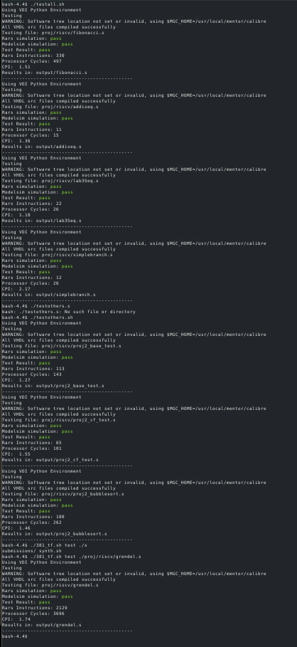

# pipelined-riscv-cpu
A fully-functional 5-stage pipelined RISC-V–based processor I implemented in VHDL as part of ISU CPRE curriculum. To avoid IP issues, this respository contains only my own thoughts, ideas, and work; I have removed anything referenced from, produced by, or otherwise aided in the creation of through others.

## Key Features
- Full RV32-I base RISC-V integer unpriviliged instruction set support
- 5-stage pipelined design with an unoptimized maximum frequency of 53 MHz
- Native VHDL2008 implementation compatible with both Siemens (R) QuestaSim (TM) and Intel (R) Quartus (TM).

